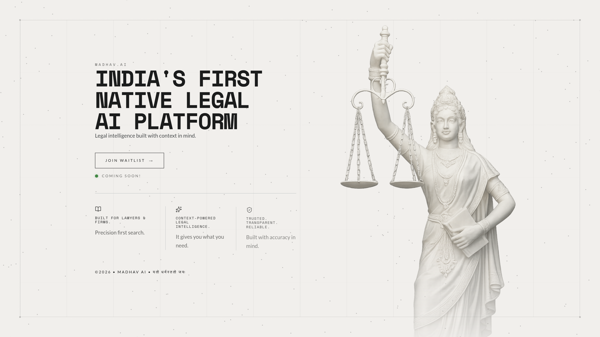
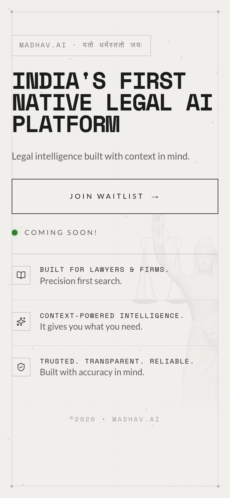

<div align="center">

# Madhav.AI - Coming Soon Page

### _India's First Native Legal AI Platform_


<p><em>Desktop View</em></p>

---

<br>


<p><em>Mobile View</em></p>

_A bold, editorial-style coming soon landing page for Madhav.AI, built with Next.js and TypeScript._

[View Live Site](https://madhav-ai.com/) • [Preview Build](https://madhav-ai-coming-soon.vercel.app/)

</div>

---

<br>

## Table of Contents -

- [About The Project](#-about-the-project)
- [Features](#-features)
- [Tech Stack](#-tech-stack)
- [Project Structure](#-project-structure)
- [Getting Started](#-getting-started)
- [Design Philosophy](#-design-philosophy)
- [Responsiveness](#-responsiveness)
- [Performance Optimizations](#-performance-optimizations)
- [Blog](#-blog)
- [Credits & Acknowledgments](#-credits--acknowledgments)
- [License](#-license)
- [Contact](#-contact)

---

<br>

## 🎯 About The Project:

**Madhav.AI** is a legal intelligence platform built for lawyers and firms. This coming soon website is the brand's first digital touchpoint, designed to communicate trust, clarity, and momentum while capturing early interest.

### Why This Project?

The goal was to craft a **premium, minimal, and authoritative** landing page that:

- Establishes brand credibility immediately.
- Communicates the value proposition in a single glance.
- Invites early users to join the waitlist.
- Feels handcrafted, not templated.
- Performs fast and looks great across devices.

---

<br>

## ✨ Features:

### **Visual & Interactive Elements**

- **Hero Reveal Animation** - Smooth, staged intro animations for key content.
- **Particle Field** - Subtle motion layer for depth and atmosphere.
- **Editorial Grid** - Structured layout system to keep typography crisp.
- **Construction Markers** - Micro-branding elements for a refined, under-construction feel.
- **Staggered Feature Strip** - Highlighted product values with animated cards.

### **Content Sections**

1. **Hero Section** - Core value proposition and call-to-action.
2. **Feature Strip** - Key benefits tailored for legal workflows.
3. **Brand Motif Footer** - Sanskrit tagline and brand signature.

### **User Experience**

- **Waitlist CTA** - Direct link to Tally form for signups.
- **Responsive Typography** - Clamp-based scaling for consistent hierarchy.
- **Accessible Contrast** - High-contrast palette for readability.

---

<br>

## Tech Stack:

This project is built with a modern React/Next.js stack.

| Technology       | Purpose                      |
| ---------------- | ---------------------------- |
| **Next.js**      | App framework and routing    |
| **React**        | UI composition               |
| **TypeScript**   | Type-safe development        |
| **Tailwind CSS** | Utility-first styling        |
| **GSAP**         | Animation and reveal effects |
| **Vercel**       | Preview deployments          |
| **Cloudflare**   | Production hosting pipeline  |

---

<br>

## Project Structure:

```
madhav-ai-coming-soon/
│
├── app/
│   ├── global.css
│   ├── layout.tsx
│   └── page.tsx
├── components/
│   ├── ConstructionMarkers.tsx
│   ├── EditorialGrid.tsx
│   ├── FeatureStrip.tsx
│   ├── Hero.tsx
│   ├── particlefield.tsx
│   ├── statuehero.tsx
│   ├── useHeroReveal.ts
│   └── useMouseParallax.ts
├── public/
├── next.config.ts
├── package.json
└── README.md
```

---

<br>

## Getting Started:

### Prerequisites:

- **Node.js** 20.19+ (Vercel) or **Node.js** 22+ (Cloudflare tools)

### Local Development:

1. **Install dependencies**

   ```bash
   npm install
   ```

2. **Start dev server**

   ```bash
   npm run dev
   ```

3. **Build for production**
   ```bash
   npm run build
   ```

### Deployment:

- **Vercel**: connect the repo and use `npm run build`.
- **Cloudflare**: use the dedicated scripts:

```bash
npm run cf:build
npm run cf:deploy
```

---

<br>

## Design Philosophy:

### Color Palette:

The site uses a muted editorial palette to feel premium and trustworthy:

| Color            | Hex Code  | Usage                    |
| ---------------- | --------- | ------------------------ |
| **Warm Gray**    | `#f2f0ed` | Primary background       |
| **Ink Black**    | `#1b1c1c` | Primary text and borders |
| **Slate**        | `#5e5e5c` | Secondary text           |
| **Accent Green** | `#2f7d32` | Status dot and accents   |

### Typography:

- **Heading Font**: Space Mono
- **Body Font**: Lato

### Design Principles:

- **Editorial Layout** - Strong grids and structured rhythm.
- **Minimal UI** - High focus on headline and messaging.
- **Atmosphere** - Subtle noise and particle motion for depth.
- **Performance First** - Lightweight assets and optimized rendering.

---

<br>

## Responsiveness:

The site is fully responsive across mobile, tablet, and desktop breakpoints.

### Breakpoints:

| Device      | Viewport Width | Layout                         |
| ----------- | -------------- | ------------------------------ |
| **Mobile**  | ≤ 640px        | Stacked layout, single column  |
| **Tablet**  | 641px - 1024px | Split layout, adjusted spacing |
| **Desktop** | > 1024px       | Full editorial multi-column    |

### Responsive Features:

- **Fluid Typography** - `clamp()` based scaling
- **Touch-Friendly CTA** - Large tap targets
- **Adaptive Layout** - Hero shifts between single and split columns

---

<br>

## Performance Optimizations:

### Speed Enhancements:

- **Static Rendering** - Pre-rendered for fast load times.
- **Optimized Animations** - GPU-friendly transforms.
- **Minimal JS** - Focused interactions only where needed.
- **Lean CSS** - Tailwind for small, composable styles.

---

<br>

## Credits & Acknowledgments:

### Assets & Resources:

- **Favicon**: [Flaticon](https://www.flaticon.com/)
- **Icons**: React icon libraries used in the UI
- **Fonts**: Google Fonts.

---

<br>

## License:

This project is proprietary to **Madhav.AI**.

--

### Developer & Designer:

Feel free to support me on the respective platforms, most of them are still a work in progress for uploading and building Portfolio :D.

- **GitHub**: [@anirxddh](https://github.com/anirxddh)
- **LinkedIn**: [Aniruddha Dey](https://www.linkedin.com/in/aniruddha-dey/)
- **X**: [Aniruddha Dey](https://x.com/anirxddh)
- **Behance**: [Aniruddha Dey](https://www.behance.net/anirxddh)
- **Dribble**: [Aniruddha Dey](https://dribbble.com/anirxddh)

--- 

<br>

## Journal:

My first typescript venture and phew this language is difficult. Hours of asking chatgpt, Andrew NG and HuxnDev tutorials later I created this for my startup which I am building with a senior, a rather bad decision to make such a complex project for the first time being. 

But here is it anyway, will looking forward to more complex stuff! Stay tuned!

---
<br>

## Show Your Support!

If you like this project, please give it a ⭐ on GitHub!

<br>
